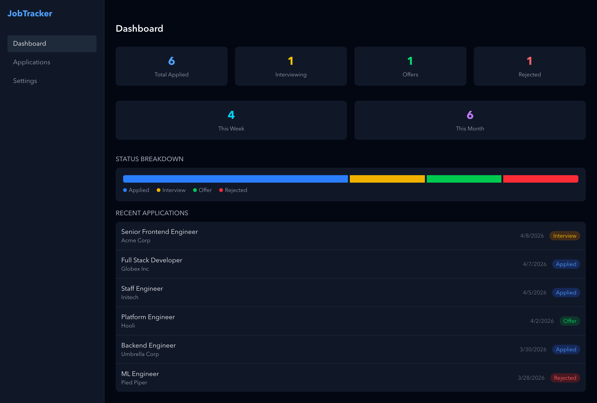
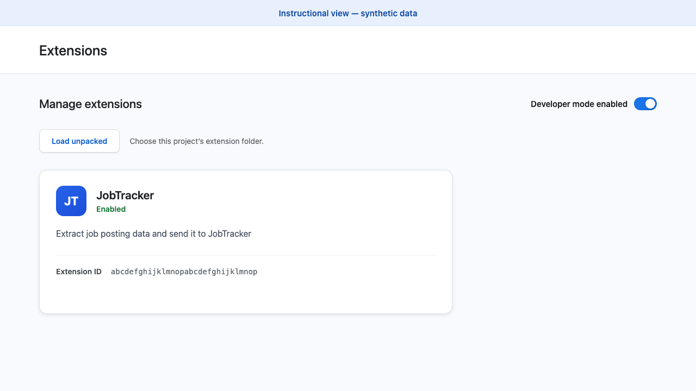
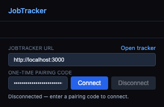
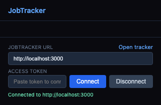
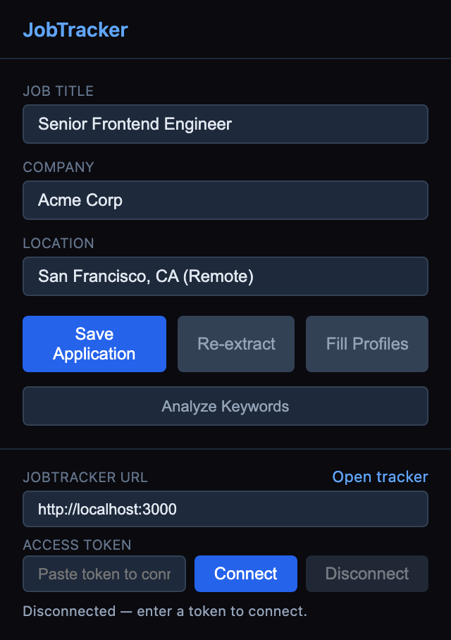
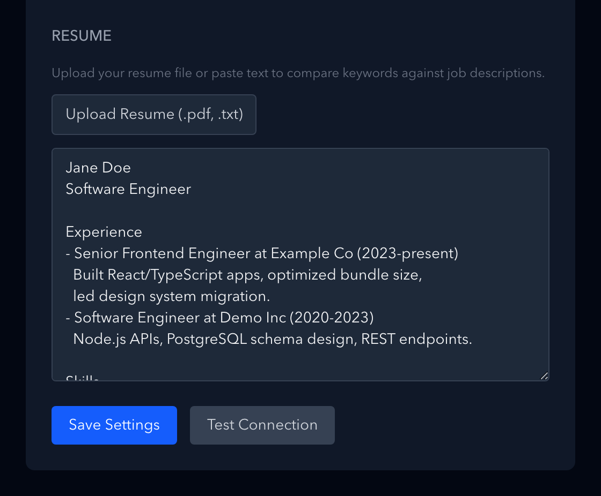
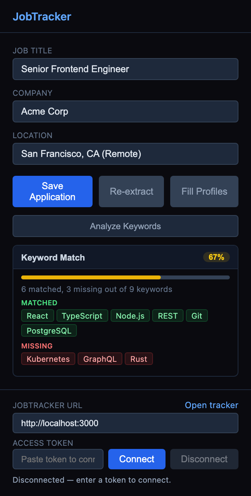
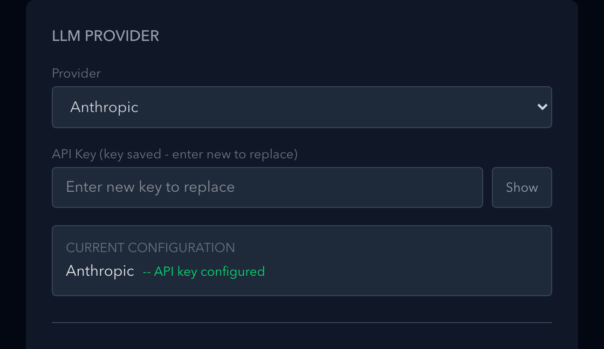

# JobTracker

JobTracker is a self-hosted job application tracker with a Chrome extension. The extension reads a job posting from the tab you are viewing, while the JobTracker web server stores the application and provides search, status tracking, resume matching, and settings.

This guide starts with a local setup so you can verify the complete workflow before deploying it.

> Production identity maintenance follows the [authoritative production
> operations runbook](docs/operations/production-runbook.md#application-identity-maintenance-rollout),
> which is the sole source of executable operator commands and ordering.

## What You Can Do

- Save jobs from LinkedIn, Indeed, Glassdoor, Lever, Greenhouse, Workday, and other career pages.
- Review, search, filter, edit, and delete applications from one dashboard.
- Compare a job description with a saved resume and review matched and missing keywords.
- Fill saved LinkedIn and GitHub profile URLs into supported application forms.
- Use standard page metadata or optional AI-assisted extraction.



## How JobTracker Works

The data flow is:

**Chrome extension → JobTracker server → PostgreSQL**

**The extension is not standalone.** It extracts data from the current tab, but it needs a running JobTracker server to authenticate requests, save applications, load settings, and analyze keywords. The server stores application data in the PostgreSQL database configured by `DATABASE_URL`.

JobTracker has two interfaces:

- The web app at your configured `APP_BASE_URL`, where you manage applications, your resume, profiles, and optional AI providers.
- The unpacked Chrome extension in [`extension/`](extension/), which connects to that server and works on supported job pages.

There are no separate native macOS, Windows, or Linux applications. Use Google Chrome for the extension and run the Node.js server with access to PostgreSQL.

## Prerequisites

Install these before you begin:

- **Google Chrome 140 or newer** for the extension.
- **Node.js 22.22.2**. The repository also pins this version in [`.nvmrc`](.nvmrc) and [`.node-version`](.node-version).
- **npm**, included with Node.js.
- **PostgreSQL** and an empty database that your local account can access. Install it from the [official PostgreSQL downloads](https://www.postgresql.org/download/), or use pgAdmin or a managed PostgreSQL service.
- **Git** to clone the repository.

You will also need the PostgreSQL username, password, host, port, and database name for `DATABASE_URL`.

## Local Quick Start

### 1. Download and install

```bash
git clone https://github.com/taejunoh/easy-job-application-tracker.git
cd easy-job-application-tracker
npm ci
```

`npm ci` installs the exact dependency versions recorded in `package-lock.json`.

### 2. Create your environment file

Use this Node.js command instead of an operating-system-specific copy command:

```bash
node -e "const fs=require('node:fs');if(fs.existsSync('.env')){console.log('.env already exists; leaving it unchanged')}else{fs.copyFileSync('.env.example','.env',fs.constants.COPYFILE_EXCL)}"
```

If `.env` already exists, this command preserves it and does not overwrite your credentials.

Generate two different secrets. Run this command twice and keep both outputs private:

```bash
node -e "console.log(require('node:crypto').randomBytes(32).toString('base64'))"
```

Use the first output for encryption and the second output for application
access. Edit `.env` so the five required variables and optional rollout gates
follow this local template:

```dotenv
DATABASE_URL="postgresql://<db-user>:<db-password>@127.0.0.1:5432/<db-name>"
ENCRYPTION_SECRET="<first-generated-secret>"
APP_ACCESS_TOKEN="<second-generated-secret>"
APP_BASE_URL="http://localhost:3000"
CORS_ALLOWED_ORIGINS="http://localhost:3000,chrome-extension://<extension-id>"
APPLICATION_IDENTITY_WRITES_ENABLED="0"
APPLICATION_WRITES_ENABLED="1"
```

Reserved URL characters in the database username, password, or database name must be percent-encoded before you place those components in `DATABASE_URL`. For example, encode `@` as `%40`.

The `<extension-id>` value is not known until you load the extension. You can first leave that placeholder in `.env`, complete [Install the Chrome Extension](#install-the-chrome-extension), then replace it before starting the server.

The placeholder values copied from `.env.example` are intentionally rejected by startup validation. Replace every placeholder before running `npm run dev` or `npm start`.

The variables serve these purposes:

| Variable | Purpose |
| --- | --- |
| `DATABASE_URL` | PostgreSQL connection string used by Prisma and the server. |
| `ENCRYPTION_SECRET` | Separate secret used to encrypt stored provider credentials. |
| `APP_ACCESS_TOKEN` | Private root credential used only by the web `/connect` page to create an administrator session. Never paste it into the Chrome extension. It is not a provider API key. |
| `APP_BASE_URL` | Exact public origin of the JobTracker server, with no path. Use `http://localhost:3000` locally. |
| `CORS_ALLOWED_ORIGINS` | Comma-separated origins allowed to call the server. Include the app origin and the exact `chrome-extension://<extension-id>` origin. |
| `APPLICATION_IDENTITY_WRITES_ENABLED` | Server-only identity gate. It accepts only `"0"` or `"1"` and defaults to `"0"`; keep it disabled until the identity migration and any required legacy-data backfill are verified. |
| `APPLICATION_WRITES_ENABLED` | Server-only application-write gate. It accepts exactly `"0"` or `"1"`; a missing value defaults closed (`"0"`). Any defined invalid value—including blank, whitespace, `true`, or another string—fails validation. Production must set it explicitly; normal local/CI uses `"1"`, while maintenance uses `"0"`. |

Do not commit `.env`, reuse one generated value for both secrets, or paste either secret into screenshots or issue reports.

For a new empty local database, leave the identity gate at `"0"` while you
apply the checked-in migrations, and use `APPLICATION_WRITES_ENABLED="1"` for
normal local/CI work. You may enable the identity gate only after migration
status is current and the `Application` table is confirmed empty. For an
existing database, follow the maintenance rollout in the
[production operations runbook](docs/operations/production-runbook.md); do not
enable either maintenance gate before its dry run, backfill, and verification
are complete. `APPLICATION_WRITES_ENABLED` is server-only and is never a
Chrome-extension setting. Keep the identity-gate distinction clear: the
identity gate controls identity maintenance writes, while the application gate
controls ordinary Application mutations.

### 3. Prepare the database

If you installed PostgreSQL locally and its command-line tools are available, create the empty database with:

```bash
createdb jobtracker
```

Replace `jobtracker` with your chosen database name if needed. Creating it in pgAdmin or with a managed PostgreSQL provider is also fine. In every case, the database name, user, password, host, and port in `DATABASE_URL` must match the database you created. Then run:

```bash
npx prisma validate
npx prisma generate
npx prisma migrate deploy
```

These commands validate the Prisma schema, generate the client, and safely apply the checked-in migration history.

### 4. Start JobTracker

After replacing `<extension-id>` with the ID from the next section, start the local server:

```bash
npm run dev
```

Open [http://localhost:3000](http://localhost:3000). The supported development command loads `.env` and validates the complete server configuration before opening a listener.

The web app also requires authentication. Open [http://localhost:3000/connect](http://localhost:3000/connect) and enter the value you generated for `APP_ACCESS_TOKEN` to create the browser session.

## Install the Chrome Extension

1. Open `chrome://extensions` in Google Chrome.
2. Turn on **Developer mode** in the upper-right corner.
3. Click **Load unpacked**.
4. Select the repository's [`extension/`](extension/) folder. Select the folder itself, not an individual file.
5. On the JobTracker details card, copy the 32-character extension **ID**.
6. Replace `<extension-id>` in `CORS_ALLOWED_ORIGINS` with that exact ID. The resulting origin should look like `chrome-extension://<extension-id>`.
7. If the server is already running, stop it and run `npm run dev` again so it reads the updated environment.
8. Use Chrome's extensions menu to pin JobTracker to the toolbar.



Chrome may show the extension's declared job-site patterns under **Site access** on the extension details page. The permission requested during **Connect** is different: it is access to the configured JobTracker server origin.

## Connect the Extension

1. Sign in to the web app through `/connect` with `APP_ACCESS_TOKEN`.
2. Open **Settings → Chrome extension installations**, select the exact configured extension origin, and choose **Create pairing code**.
3. Open a supported job posting, then click the pinned JobTracker icon.
4. Enter `http://localhost:3000` in **JobTracker URL** and paste the one-time pairing code into **One-time pairing code**.
5. Click **Connect**.
6. Approve the Site Access request if Chrome shows it. Chrome asks for access to the configured JobTracker server origin, not the current job site.



When pairing succeeds, the popup shows **Connected** and enables actions supported by the current page.



The pairing-code field is cleared after a successful connection. An empty pairing-code field while the popup says **Connected** is expected: each code can be used only once, and the extension stores a separate installation credential without displaying it.

Use **Disconnect** to remove the stored connection and revoke the runtime-requested server permission. Some Chrome versions may retain a previously requested server origin on the extension details page. The popup cleanup warning and the server-origin permission toggle are authoritative: if the popup reports that cleanup remains pending, follow that warning; if the toggle is off, host access is no longer granted. Mere list presence does not mean the extension remains connected.

## Save Your First Job

1. Open a job posting on LinkedIn, Indeed, Glassdoor, Lever, Greenhouse, Workday, or another career page.
2. Click the JobTracker toolbar icon. The popup extracts the title, company, location, description, and page URL when available.
3. Check the extracted title, company, and location. Edit those fields if the source page is ambiguous.
4. Click **Save Application**.
5. Open the JobTracker dashboard and confirm that the application appears. From there you can change its status, add notes, edit details, search, filter, or delete it.



If the page changes after the popup opens, use **Re-extract** before saving. A saved job is written by the server to PostgreSQL; closing Chrome does not remove it.

## Set Up Resume Matching

1. Open **Settings** in the JobTracker web app.
2. Under **Resume**, upload a PDF resume or paste a text resume.
3. Save the settings.
4. Return to a job in the dashboard or extension and select **Analyze Keywords**.



JobTracker compares the saved resume text with the job description and reports matched and missing keywords. Review the result as a writing aid; it is not a hiring prediction.



To fill profile links on supported application forms, add your LinkedIn and GitHub URLs under **Settings > Profile URLs**, save them, then click **Fill Profiles** in the extension.

## Optional Features

Basic extraction does not require an AI provider. When a site lacks useful structured metadata, optional AI extraction can interpret pasted or extracted job text.

JobTracker supports these providers:

- OpenAI
- Gemini (Google)
- Anthropic

Choose a provider in **Settings**, enter that provider's API key, then save. Provider models are selected internally; this version does not expose a user-editable model setting. Provider credentials are encrypted with `ENCRYPTION_SECRET` before storage. Do not put provider API keys in `APP_ACCESS_TOKEN` or commit them to the repository.



## Troubleshooting

| Symptom | Likely cause | Action |
| --- | --- | --- |
| Chrome does not show a permission prompt | Access to that server origin was already granted, or Chrome did not open a new prompt. | Click **Connect** with the exact server origin. In `chrome://extensions`, confirm JobTracker is enabled and check the configured server origin under Site access; the request is not for the current job site. |
| The popup says **Disconnected** | The extension has not paired with this server, its saved state was cleared, or the unpacked extension was reloaded. | Confirm the server is running, create a fresh one-time pairing code under **Settings → Chrome extension installations**, enter the exact server origin without a trailing path, and click **Connect** again. |
| A request returns HTTP `401` | The installation credential was revoked, expired, or is otherwise no longer accepted. | Disconnect, create a fresh one-time pairing code in Settings, and reconnect. Never send a pairing code or credential as part of a URL. |
| The server origin remains in Chrome's Site access list after **Disconnect** | Some Chrome versions may retain the entry after its permission has been removed. | Check the popup for a cleanup warning and confirm the server-origin permission toggle is off. The warning and toggle, rather than mere list presence, show whether cleanup is pending or access remains granted. |
| Extracted fields are missing or inaccurate | The page is still loading, uses an unusual layout, or exposes incomplete metadata. | Wait for the job page to finish loading, reopen the popup, and click **Re-extract**. Edit fields before saving; for unusual layouts, use text paste mode and optionally configure an AI provider. |
| **Save Application** fails | The connection, job URL, server, or PostgreSQL database is unavailable or invalid. | Confirm the popup is **Connected**, the server is reachable, the job URL is valid, and PostgreSQL is running. Check the server terminal for the specific error. |
| **Analyze Keywords** fails or shows no result | No resume is saved, or the application has no job description. | Save a PDF or text resume in Settings. Re-extract or edit the application if its description is empty. |
| Resume upload fails | The file is not PDF or TXT, exceeds 5 MB, is unreadable, or is a PDF with more than 100 pages. | Choose a readable `.pdf` or `.txt` file no larger than 5 MB and, for PDF, no more than 100 pages. You can paste the resume text instead. |
| `prisma migrate deploy` fails | `DATABASE_URL`, database availability, credentials, TLS requirements, or migration state is incorrect. | Recheck the connection, then run `npx prisma migrate status`. Do not reset a database that contains data you need. |
| Startup reports `.env` validation errors | A placeholder remains, a secret is invalid, or an origin is missing or includes a path. | Replace every placeholder, use two separately generated secrets, and ensure `APP_BASE_URL` plus the exact extension origin appear in `CORS_ALLOWED_ORIGINS`. Restart after editing `.env`. |

For production-only connection, deployment, backup, and recovery problems, use the [production operations runbook](docs/operations/production-runbook.md).

## Production Deployment

The supported hosted topology is Vercel for the Next.js application and Neon, or another managed PostgreSQL provider, for the database. Start with an empty PostgreSQL database and configure the five required server variables plus both server-only rollout gates, `APPLICATION_IDENTITY_WRITES_ENABLED` and `APPLICATION_WRITES_ENABLED`, in the Production environment. Production must set both gates explicitly; use a canonical HTTPS origin for `APP_BASE_URL` and include that origin plus only approved Chrome extension origins in `CORS_ALLOWED_ORIGINS`.

The **Vercel Next.js preset** runs `npm run build`; Vercel does not run `npm start`. When the build loads `next.config.ts`, JobTracker validates the complete server environment at **build time**. At **request-serving runtime**, `src/instrumentation.ts` validates it again before a new Node.js server instance handles requests. `npm start` pre-listen validation applies to **self-hosted Node only**.

For a self-hosted Node production server, build and start with:

```bash
npm run build
npm start
```

For self-hosted Node, `npm start` and `npm run dev` are the supported launch contracts. Direct `next start` and `npx next` commands are unsupported because they bypass the preloaders in `scripts/validate-startup-env-production.mjs` and `scripts/validate-startup-env-development.mjs`. The `src/instrumentation.ts` check remains request-blocking defense in depth.

Do not give Vercel Preview deployments Production database credentials. Preview builds also validate environment variables, so use Preview-only credentials, a stable Preview HTTPS alias, and a disposable PostgreSQL database if Preview routes need database access.

After deployment, open `/connect` on the canonical HTTPS origin and enter `APP_ACCESS_TOKEN`. In the authenticated Settings page, create a one-time pairing code for the exact allowed extension origin and use that code in the popup; never give the root token to the extension. Follow the [production operations runbook](docs/operations/production-runbook.md) for deployment verification, Chrome pairing, logs, Neon connectivity, backups, restore tests, incident response, and rollback.

### Production health automation

The hourly `Production monitor` workflow authenticates to the canonical HTTPS
origin and requires an exact `200` response from `/api/stats`. It reads the
origin from the `PRODUCTION_APP_URL` repository variable and the root monitor
credential from the `PRODUCTION_APP_ACCESS_TOKEN` repository secret. A failed
run is an incident signal; do not loosen authentication or the response
contract to make it pass.

The nightly production-backup workflow uses PostgreSQL 17 tools to create a
custom-format dump, verifies a scratch restore and deterministic database
fingerprints, and uploads only an age-encrypted artifact with sanitized
evidence. Configuration, manual-dispatch verification, recovery-key handling,
and restore rehearsal steps are defined in the
[production operations runbook](docs/operations/production-runbook.md).

## Database Migration Notes

For a new empty PostgreSQL database, apply only the checked-in migration history:

```bash
npx prisma validate
npx prisma generate
npx prisma migrate deploy
npx prisma migrate status
```

Confirm the `Application`, `Settings`, `ExtensionInstallation`,
`ExtensionPairingGrant`, and `_prisma_migrations` tables exist before serving
traffic. No seed is required; the Settings singleton is created only on the
first successful PUT /api/settings. An authenticated GET /api/settings is
read-only and does not create the row.

If an existing database was previously created with `prisma db push`, first take a verified backup and compare it with the current Prisma schema:

```bash
npx prisma migrate diff --from-config-datasource --to-schema prisma/schema.prisma --exit-code
```

Continue only when the diff is empty. Record the initial migration as applied, deploy later migrations, and verify status:

```bash
npx prisma migrate resolve --applied 20260713000000_init
npx prisma migrate deploy
npx prisma migrate status
```

Never use a destructive reset, `db push` data-loss acceptance, or an unreviewed down migration on a database containing records you need. A safe rollback restores a tested backup. Legacy data imports require a separately reviewed export/import process. See the [production operations runbook](docs/operations/production-runbook.md) and the [sanitized production cutover record](docs/operations/production-cutover-2026-07-14.md) before changing a production database.

### Production identity maintenance

The Settings singleton is created only on the first successful PUT /api/settings; an authenticated GET /api/settings is read-only and does not create the row. The complete staged candidate, rollback, fixture-ledger, and cleanup procedure is the [production operations runbook](docs/operations/production-runbook.md#application-identity-maintenance-rollout).

#### Rollout state and evidence summary

The operator-state summary is: after database apply, the rollout is
`PAUSED_AFTER_APPLY`; failed or ambiguous evidence enters `HOLD_PAUSED`, where
there is no build, deploy, alias assignment, or promotion. After approval, the
exact recorded `identity=1,writes=0` Ready deployment is resumed as
`UNPAUSED_READONLY` for read-only and authenticated negative probes. A regression
requires an exact Ready candidate ID and reviewed SHA or returns to
`HOLD_PAUSED`. The private ledger retains exact owned IDs until bounded cleanup
is verified and cleanup may remove only those IDs.

Production identity maintenance is a manual, ordered two-gate operation. Start
with an `identity=0,writes=1` Ready canonical support deployment. Before Stage
1 promotion, authenticated supported flows must create one disposable
Application, one installed extension credential, and a second unconsumed
pairing grant. Keep their URL, IDs, tokens, pairing codes, and request/response
bodies only in a private mode-0700 operator workspace; never put them in logs,
artifacts, Actions output, shell history, PR/comments, or docs.

Stage a `identity=1,writes=0` Ready Production candidate with the exact
`vercel --prod --skip-domain` command. Inspect that it is Ready, has the exact
intended Git SHA, and has no canonical alias; promote the candidate while
unpaused. Start a bounded drain, wait at least `2 × maxDuration` (at least 60
seconds when modules have 30-second maximum duration), and pass the
authenticated negative probe. Use the exact fixtures to prove all eight
persistent mutations return `503 writes_stopped`: Application POST/PATCH/DELETE,
Settings PUT, pairing creation, valid pair exchange, installation deletion, and
self-revoke. Also prove Settings GET does not create a row and
installation-authenticated reads do not change `lastUsedAt/updatedAt`.

Only then pause Vercel and require the actual canonical `503 DEPLOYMENT_PAUSED`
before prepare/apply. Prepare, privately review, and apply the identity
backfill only while paused. Paused Vercel blocks build and promotion: never
attempt either while paused. There is no build or promotion while paused.
Resume the recorded same read-only
`identity=1,writes=0` deployment without redeploying, then stage a final Ready
`identity=1,writes=1` Production candidate with `vercel --prod --skip-domain`.
Inspect its exact SHA and no canonical alias, promote while unpaused, run smoke
and bounded cleanup, and resume external writers last. External writers are
resumed last. After final promotion, external writers are resumed last; delete the disposable Application,
consume the still-unconsumed grant exactly once, revoke both disposable
installations, verify bounded cleanup, and record only sanitized
statuses/counts/hashes. The full sequence and
sanitized evidence fields are in the [production operations runbook](docs/operations/production-runbook.md).

Prepare and apply are dispatched from `main` only after the required writer-stop
attestation and pause evidence. The operator records numeric prepare/apply run
identifiers. Capture and wait for numeric `PREPARE_RUN_ID`, verify its exact
rollout SHA, and privately review the prepare
artifact. The attestation is recorded as `writers_stopped=true`, and apply
receives the approved numeric `prepare_run_id`. The
authoritative [Production identity maintenance
runbook](docs/operations/production-runbook.md#application-identity-maintenance-rollout)
defines the dispatch and observation procedure. Writers remain stopped
continuously until every post-resume smoke pass succeeds. Any failure means
writers remain stopped continuously; do not run `prisma db push`, `prisma db
reset`, or destructive shortcuts. Record only the Git SHA, old/new/staged/
canonical deployment IDs, promotion and drain times, monitor/negative-probe
run IDs, backup/prepare/apply run IDs and safe artifact digests/names,
pause/resume evidence, and sanitized cleanup status. The rollback target is
the recorded Ready `identity=1,writes=0` deployment; rollback or promotion is
allowed only while unpaused, and after DB apply never target identity-unaware
code.

## Development and Verification

Run the normal repository checks before opening a pull request:

```bash
npm run check:audit
npm run check:extension
npm run test:ci
npm run lint
npm run typecheck
npm run build
npm run check:startup-env
```

CI enforces the dependency-audit policy with `npm run check:audit`. The workflow uses Node.js 22.22.2 and a disposable PostgreSQL service. It validates and deploys migrations, checks schema parity and extension assets, runs tests, lints, typechecks, builds, and verifies invalid startup configuration is rejected.

Changes to backup or restore behavior also require the digest-pinned real
PostgreSQL 17 interruption proof:

```bash
npm run test:backup:docker
```

This guarded test requires Docker. It verifies successful fingerprinting and
SIGINT/SIGTERM cleanup without leaving database sessions, locks, credentials,
or temporary backup artifacts behind.

### Chrome extension E2E

For the guarded local wrapper, run:

```bash
npm run test:extension:e2e:local
```

It requires a local **PostgreSQL 17** server on `127.0.0.1:5432` and refuses to reuse the disposable database named `jobtracker_extension_e2e_test`. It creates that database, builds the app with fixed test-only values, starts two isolated installations of Playwright's **bundled Chromium** with separate temporary profiles, runs the real extension journey, and removes the database during cleanup.

The lower-level CI command is `npm run test:extension:e2e`. Do not run it directly unless all destructive-test sentinels, database identity checks, migrations, build outputs, and browser prerequisites are already in place. The test never launches or modifies your system Chrome profile.

For automated coverage, production smoke steps, cleanup expectations, and privacy rules, follow the [Chrome extension smoke runbook](docs/operations/chrome-extension-smoke.md).

### Screenshot maintenance

Regenerate all documentation screenshots with `npm run screenshots`, or only the synthetic connection setup images with `npm run screenshots:setup`. The setup generator is deterministic and blocks network access so documentation does not capture real origins, extension IDs, credentials, or profile data. See the [screenshot guide](docs/screenshots/README.md).

## Documentation

- [Quarantine operations runbook](docs/operations/quarantine-runbook.md) — lossless numbered-copy cleanup, reconciliation, recovery, validation retention, and restore. Stop writers before every mutating command; never use `git clean`, move payloads manually, edit the journal, or treat `deleteAfter` as deletion approval.
- [Production operations runbook](docs/operations/production-runbook.md)
- [Chrome extension smoke runbook](docs/operations/chrome-extension-smoke.md)
- [Sanitized production cutover record](docs/operations/production-cutover-2026-07-14.md)
- [Screenshot generation guide](docs/screenshots/README.md)
- [Dependency audit report](docs/security/dependency-audit-2026-07-14.md)

## License

MIT
