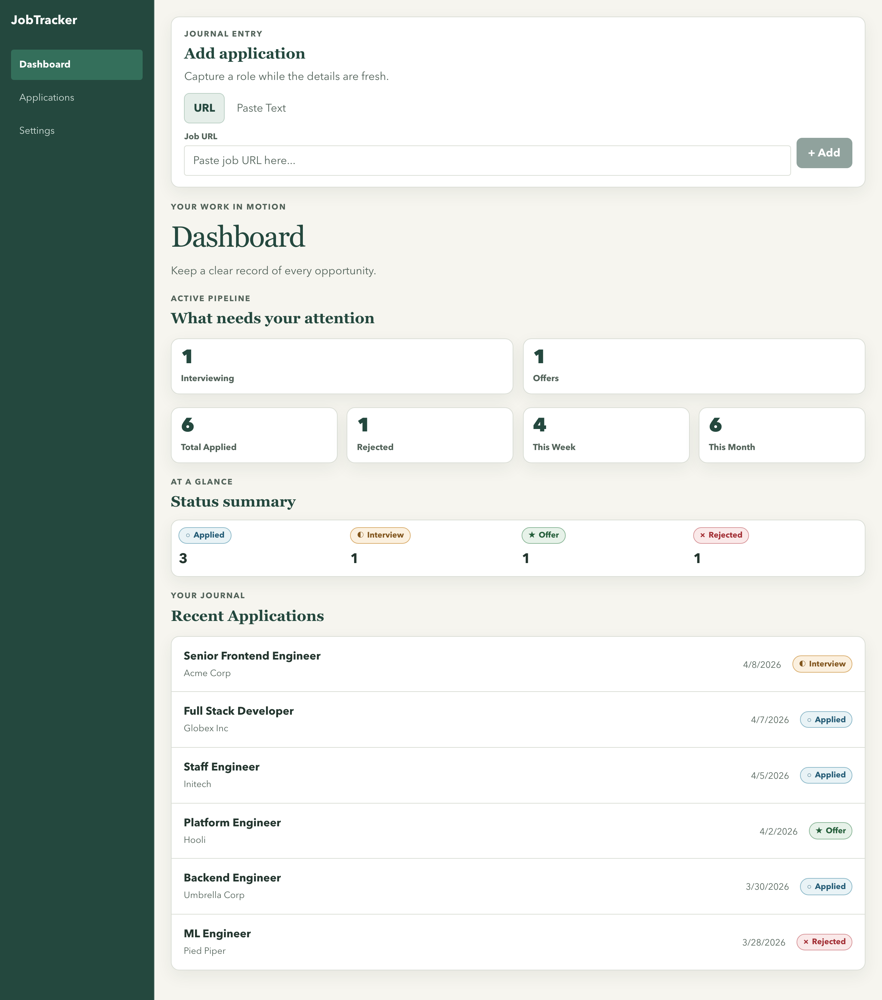

# JobTracker

JobTracker is a private, self-hosted web app for saving job applications, tracking their status, and comparing job descriptions with your resume. Its optional Chrome extension can capture a job posting from the tab you are viewing.



## Run it locally

The local setup runs the production Next.js app and PostgreSQL in Docker. It is intended for one person on their own computer, not as a public or multi-user server. Docker must be installed and its local daemon running.

Prerequisites: Git, Node.js **22.22.2 or newer in the 22.x series** (`>=22.22.2 <23`), npm (included with Node.js), and Docker with Docker Compose.

```bash
git clone https://github.com/taejunoh/easy-job-application-tracker.git
cd easy-job-application-tracker
npm run setup
```

The first setup downloads and builds the app image, so it can take several minutes. Setup creates a local PostgreSQL database, applies migrations, and starts the app. It does not require `npm ci`, a separately installed PostgreSQL server, or manual secret generation on your computer.

Open the URL printed by setup (by default, `http://127.0.0.1:3000`), then add `/connect` to that same URL and enter the access token shown by this command:

```bash
npm run local:token
```

The token is a private web sign-in credential. Paste it only into your local `/connect` page. Never put it in the extension, a URL, a chat, a screenshot, or a commit.

## Save your first application

1. On the Dashboard, use the open **Add application** card and choose **URL**.
2. Paste a job posting URL and submit it. JobTracker can use page metadata without an AI key; a page that requires login or blocks fetching may not be readable.
3. Review the confirmation. Extraction can be incomplete: edit the title and company if needed. Title, company, and job URL are required to save.
4. Choose **Save Application** and find the result under **Applications**.

If URL extraction cannot provide enough information, **Paste Text** requires both the job description and its URL, plus a saved provider API key. AI requests use your selected provider account and may incur its usage charges. Manual entry is a validation-only tab, off by default; leave it off for normal use.

The Dashboard's **Add application** card is open by default; on other pages, use **+ Add application** to open it. Drafts survive navigation within the app, but not a browser refresh.

On narrow screens (768px wide or less), navigation becomes an inline menu and application rows become cards.

## Keep your local data

The setup stores generated configuration and credentials in the ignored `.jobtracker/local.env` file, and application data in a Docker-managed PostgreSQL volume. Neither is committed to Git. Stop and restart the app without deleting either:

```bash
npm run local:stop   # stop containers; keep database and credentials
npm run local:start  # start again with the same data
npm run local:logs   # view app and database logs
```

Keep the configuration file and Docker volume together. In particular, losing the configuration also loses the `ENCRYPTION_SECRET`; without that exact secret, stored provider API keys cannot be decrypted. Do not delete either as a generic troubleshooting step.

To update a Git checkout, pull the new version and run `npm run setup` again. Choose a non-default port on the first setup with `npm run setup -- --port 3001`; the port is saved in local configuration and cannot be changed by a later setup retry. If that saved port is occupied, stop the service using that port and retry setup with the existing configuration. Do not delete `.jobtracker/local.env` to change ports or repair a startup problem. If Docker is unavailable, start its local daemon and retry. If setup reports invalid managed configuration, preserve the file and ask for help before changing it; setup intentionally does not overwrite existing credentials.

## Optional: Chrome extension

The web app works without Chrome or the extension. To use it, install Chrome 140 or newer, then:

1. Open `chrome://extensions`, enable **Developer mode**, choose **Load unpacked**, and select this repository's `extension/` folder.
2. Copy the extension **ID** shown on its details card. In the repository, run `npm run local:extension -- <32-character-extension-ID>` using that exact ID. This adds the extension origin to local CORS settings and recreates the app container; it preserves your data.
3. Sign in to JobTracker, open **Settings → Chrome extension installations**, choose the matching extension origin, then choose **Create pairing code**.
4. Open a job posting, click the extension, enter the exact local JobTracker origin shown by setup and the one-time pairing code, then click **Connect**. For example, `http://127.0.0.1:3000` and `http://localhost:3000` are different origins; the host and port must match exactly. Approve Chrome's server-origin permission prompt if shown.

There are three different credentials: the **access token** signs in to the web app; a **pairing code** expires after ten minutes, can be used once, and connects the extension; an optional **provider API key** authorizes AI extraction with OpenAI, Google Gemini, or Anthropic. Never put the access token in the extension. Do not paste any credential into a URL, chat, or commit.

## Optional: resume matching and AI

Under **Settings**, upload a PDF or TXT resume and save settings to enable keyword comparisons against saved job descriptions. A profile URL is optional. For AI-assisted extraction, select a provider and save its API key under **Settings**. Basic URL metadata extraction does not require an AI key.

## More guidance

- [Manual development setup](docs/setup/manual.md) — host-installed PostgreSQL, environment variables, migrations, and detailed extension setup.
- [Deployment and operations overview](docs/setup/deployment.md) — production boundary and links to the authoritative operator runbook.
- [Production operations runbook](docs/operations/production-runbook.md) — authoritative production deployment, backup, recovery, and incident procedures.

## License

MIT
