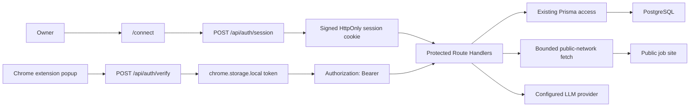

# Single-User Hosted Deployment Hardening — Design Spec

## Context

JobTracker is a personal Next.js application with a Chrome extension. The web app and extension share public App Router Route Handlers for application CRUD, settings, URL extraction, resume parsing, statistics, and keyword analysis. The current implementation assumes a trusted local machine: it has no caller authentication, several extension-facing routes use `Access-Control-Allow-Origin: *`, the extraction route fetches arbitrary URLs, and database setup relies on `prisma db push` rather than a checked-in migration.

The next deployment target is a publicly reachable, single-user hosted instance. This design hardens that deployment without adding accounts, organizations, roles, or per-row ownership. It also preserves the uncommitted extension messaging reliability work already present in `extension/content.js` and `extension/popup.js`.

## Goals

1. Preserve and verify the extension's retry-on-missing-content-script behavior and duplicate-listener guard.
2. Require a high-entropy access token for every protected API operation.
3. Give the web UI an HttpOnly session while letting the Chrome extension authenticate with a Bearer token.
4. Replace wildcard CORS with an exact origin allowlist.
5. Prevent server-side request forgery, DNS rebinding, oversized upstream responses, and unbounded redirects in job URL extraction.
6. Bound resume upload size, type, page count, extracted text size, and parse time.
7. Fail before accepting traffic when required deployment environment variables are absent or unsafe.
8. Check in a PostgreSQL initial migration and define safe adoption for both fresh and existing databases.
9. Add deterministic unit, integration, extension, and CI checks for the security baseline.

## Non-Goals

- Multi-user authentication, OAuth, invitations, teams, roles, or row ownership.
- A hosted identity provider or a new user/session database table.
- Changing the Application or Settings product model beyond what is required for migration reproducibility.
- General extraction-quality improvements, new job sites, or a new LLM abstraction.
- Browser extension store publication.
- A distributed rate-limit service. A high-entropy single-user credential and bounded inputs are the baseline; an upstream proxy may add rate limiting as defense in depth.
- Refactoring unrelated UI, styling, or application features.

## Constraints and Existing Work

- The deployment model is one trusted owner and one shared dataset.
- `extension/content.js` and `extension/popup.js` contain user-owned, uncommitted reliability changes. They must not be reverted, reformatted wholesale, or overwritten.
- The current `package-lock.json` diff is incidental churn from running npm 10 against a lockfile last written with npm 11; it removed libc metadata and is not user-owned work. Before implementation, restore only `package-lock.json` from `HEAD`. Use `npm ci` afterward and do not run `npm install` unless the implementation explicitly adds a dependency and intentionally regenerates the lockfile with the repository's npm version.
- Next.js is 16.2.2 and requires Node.js 20.9 or newer. CI will use Node.js 22.
- The API key already stored in Settings may have been encrypted with the current AES-256-GCM format. The hardening work must not make existing ciphertext unreadable.
- Existing extension and web clients expect error responses with a top-level `error` string. The hardened API retains that field.

## Approaches Considered

### Approach A — Hybrid web session and extension Bearer token

The server has one `APP_ACCESS_TOKEN`. The web owner enters it on a connect page; the server validates it and issues a signed HttpOnly session cookie. The extension pairs by validating the same token and stores it in `chrome.storage.local`, then sends it as `Authorization: Bearer` on API requests. All API handlers use one authentication helper, and unsafe cookie-authenticated requests also require the configured app origin.

Advantages:

- The long-lived access token is not exposed to web JavaScript after connection.
- The extension has an explicit, understandable pairing flow and does not rely on cross-site cookies.
- Token rotation invalidates both Bearer calls and signed web sessions.
- It works on ordinary public hosting without an external identity service.

Costs:

- Requires a connect page, a session endpoint, cookie signing, and shared authentication helpers.
- Existing web API calls must handle session expiry and redirect to reconnect.

### Approach B — Bearer token everywhere

Both the web UI and extension store the access token in browser storage and attach it to every request.

Advantages:

- Smallest server-side surface and no session cookie format.
- Identical request authentication for web and extension.

Costs:

- Web JavaScript can read the long-lived deployment credential, increasing the consequence of an XSS or malicious dependency.
- Every web fetch needs explicit header plumbing.
- Session expiry and token rotation provide a poorer user experience.

### Approach C — External reverse-proxy or VPN authentication only

The application remains unauthenticated and deployment documentation requires Basic Auth, an identity-aware proxy, or a private VPN.

Advantages:

- Strong perimeter controls are available without application session code.
- Some operators already have this infrastructure.

Costs:

- The repository cannot verify that the protection exists.
- Chrome extension authentication differs by proxy and may not work with interactive login redirects.
- A proxy misconfiguration immediately restores the current public exposure.

### Recommendation

Use Approach A. It is the smallest application-owned design that is safe for a public single-user deployment and works predictably for both browser surfaces. Reverse-proxy authentication remains compatible as an additional layer, but it is not the primary security boundary. Multi-user OAuth is intentionally excluded because it adds schema, lifecycle, and authorization complexity that the approved product model does not need.

## System Architecture



This phase centralizes cross-cutting security helpers but does not introduce a broad repository layer. Route Handlers may continue to call Prisma directly because there is only one owner and no row-level authorization. The new boundaries are:

- `server-env`: parse and validate server-only configuration once.
- `auth`: compare Bearer credentials, issue and verify web sessions, and enforce origin checks for unsafe cookie-authenticated requests.
- `cors`: evaluate exact origins and decorate both success and error responses consistently.
- `safe-fetch`: validate and fetch public HTML under strict network and size limits.
- `upload-policy`: validate resume metadata and enforce parse limits.

Each boundary must be usable without importing UI code and must have focused unit tests.

## Authentication Design

### Server credential

`APP_ACCESS_TOKEN` is a server-only high-entropy secret. Validation requires at least 32 UTF-8 bytes and rejects whitespace-only values and known sample or generation-instruction strings. Deployment documentation generates it with a cryptographically secure command rather than prescribing a human-memorable value.

Credential comparison hashes both candidate and configured values with SHA-256 and uses `timingSafeEqual` on the fixed-length digests. Authentication failures do not reveal whether the header, cookie, or token content was wrong.

### Web connection and session

`/connect` is the only public application page. It displays a password-style access token field and submits to `POST /api/auth/session`.

On success, the server issues `jobtracker_session` with:

- `HttpOnly`
- `SameSite=Strict`
- `Secure` for an HTTPS application origin, omitted only for explicit loopback HTTP development
- `Path=/`
- `Max-Age=2592000` seconds (30 days)

The cookie contains a version, expiration time, and keyed fingerprint of the current `APP_ACCESS_TOKEN`. A domain-separated session key is derived with HMAC-SHA-256 from `ENCRYPTION_SECRET`, a versioned session-key label, and the canonical application origin. The fingerprint is a second HMAC over a separate versioned label and `APP_ACCESS_TOKEN`, keyed by that session key, so the cookie does not expose an offline access-token verifier. The payload is base64url encoded and signed with HMAC-SHA-256 using the derived session key. The raw access token is never placed in the cookie. Verification checks the signature, expiration, and current keyed fingerprint. Rotating either server secret or the canonical application origin invalidates existing sessions and prevents cross-origin session replay.

`DELETE /api/auth/session` clears the cookie and requires the configured app origin, even when the cookie is absent or invalid. A lightweight `proxy.ts` verifies the cookie before protected page rendering and redirects invalid or missing sessions to `/connect`. Its matcher excludes `/connect`, all `/api/*` routes, Next.js assets, public files, and the favicon so APIs retain JSON status semantics. This redirect improves UX only; every API handler independently authenticates the request.

### API authentication

All existing product `/api/*` routes are protected. The new authentication and preflight entry points have narrower rules:

- `POST /api/auth/session` has no prior session but validates the submitted access token and app origin.
- `DELETE /api/auth/session` has no valid-session requirement but validates the app origin before clearing the cookie.
- `POST /api/auth/verify` requires a valid Bearer token and an allowed origin.
- `OPTIONS` preflight handlers require an allowed origin but no credential.

The shared API guard accepts either:

1. `Authorization: Bearer` matching `APP_ACCESS_TOKEN`, or
2. a valid `jobtracker_session` cookie.

For cookie-authenticated requests, only `GET`, `HEAD`, and `OPTIONS` are treated as safe methods. Every other method requires the `Origin` header to exactly equal `APP_BASE_URL`'s origin. Bearer-authenticated extension calls do not require same-origin CSRF validation because the credential is explicit and not ambient.

### Extension pairing

The popup retains the persisted server URL and adds an access token field plus Connect action. Manifest V3 cross-origin fetches require an explicit host permission, so the manifest declares only these optional host patterns:

- `https://*/*` for a user-selected hosted instance
- `http://localhost/*` for existing local development
- `http://127.0.0.1/*` for local development by address

These patterns live under `optional_host_permissions`, not `host_permissions`, and are not granted at install time. `<all_urls>` is prohibited. Plain HTTP for non-loopback hosts is not declared or accepted.

Pairing proceeds as follows from the user-initiated Connect click:

1. Normalize the entered server URL by removing only a trailing slash; require `https` outside localhost development.
2. Derive the exact origin and permission pattern `${origin}/*`. Check `chrome.permissions.contains`; when absent, call `chrome.permissions.request({ origins: [`${origin}/*`] })` while the click's user gesture is active.
3. If permission is denied, make no network request, store no token, retain any previously verified connection unchanged, and show that access to the selected server was not granted.
4. After permission succeeds, call `POST /api/auth/verify` with the entered token in `Authorization: Bearer`.
5. Store the verified `{ serverUrl, accessToken }` pair in `chrome.storage.local` only after both permission grant and verification succeed. A verification failure stores neither the new token nor a new active server URL.
6. Attach the Bearer header to extraction, keyword analysis, application save, settings read, and future API requests.
7. On `401`, remove only the invalid token, retain the server URL as an unpaired draft, return the popup to its connection state, and show a reconnect message.

The verified token is bound to its stored server origin. Editing the server URL does not send the old token to the new origin. When changing servers, the previous verified pair remains active until the new origin permission and token verification both succeed; the new pair then replaces it atomically. After replacement, the extension makes a best-effort `chrome.permissions.remove` for the old origin when it differs from the new origin. Failure to remove the old optional permission does not expose the token and does not roll back the verified new pair.

An existing installation may already have `serverUrl` set to localhost without a token or optional host permission. On upgrade, that value pre-fills the connection form as an unpaired draft. The next Connect click requests the loopback origin permission and verifies the newly configured access token. It never discards the existing localhost value merely because the new manifest has not yet received permission.

The access token is never rendered after storage, inserted into query parameters, or written to console output. Removing the extension or clearing extension storage removes the local credential.

## Existing Extension Messaging Reliability

The current uncommitted behavior is part of the target design:

- `sendMessageWithRetry(tabId, message)` first sends the message normally.
- If that send fails because the content script is absent, it injects `content.js` once and retries the same message once.
- Extraction, keyword analysis, and profile auto-fill use the helper rather than duplicating injection logic or relying on arbitrary delays.
- `content.js` uses `window.__jobTrackerInjected` to prevent repeated injection from registering duplicate runtime listeners.

Implementation must preserve these exact behavioral changes before adding authentication. The verification matrix covers:

| Scenario | Expected result |
|---|---|
| Supported site with manifest-loaded content script | First message succeeds; no script injection |
| Generic active tab | First message fails; one injection occurs; retry succeeds |
| Repeated popup actions on the same tab | One message listener handles each request |
| Injection itself fails | Popup reports manual-entry or connection guidance without retry loops |
| Keyword analysis or profile fill on a non-preloaded page | The same retry helper is used |

No fixed `setTimeout` is introduced as a correctness mechanism.

## CORS Policy

`CORS_ALLOWED_ORIGINS` is a comma-separated list of exact origins. It includes the canonical `APP_BASE_URL` origin and every approved `chrome-extension://` origin. Wildcards, path components, credentials in URLs, and opaque `null` origins are invalid configuration.

Rules:

- Same-origin web requests remain valid even when the browser omits `Origin` on safe requests.
- Cross-origin requests receive `Access-Control-Allow-Origin` only when the request origin exactly matches the allowlist.
- Allowed responses include `Vary: Origin`.
- Preflight responses advertise only the methods needed by the target route and allow `Authorization` and `Content-Type` headers.
- An allowed `APP_BASE_URL` origin receives `Access-Control-Allow-Credentials: true`; extension origins do not need credentialed CORS. `*` is never emitted.
- Unknown-origin preflight requests return `403` without an allow-origin header.
- An actual request with a present but unknown `Origin` returns `403` before business logic. Requests without `Origin` still require valid authentication so command-line and server-to-server administration remains possible.
- Allowed-origin error responses include the same CORS headers as successes so the extension can read structured errors.

For unpacked development extensions, the current `chrome.runtime.id` must be added explicitly to the development allowlist. Hosted production requires a stable extension ID.

## SSRF and Upstream Fetch Policy

All server-side job-page requests go through one `safeFetchJobUrl` boundary.

### URL validation

- Permit only `http:` and `https:` URLs.
- Reject embedded usernames or passwords.
- Permit ports 80 and 443 only.
- Normalize the hostname with the URL parser before resolution.
- Resolve all IPv4 and IPv6 answers and reject the target if any answer is loopback, private, link-local, unique-local, carrier-grade NAT, multicast, documentation, reserved, or otherwise non-public.
- Reject IP literals in blocked ranges using the same address classification.

### DNS rebinding and redirects

A preflight DNS lookup alone is insufficient. The outbound connection must use a controlled lookup callback or dispatcher that validates the address selected at connection time. The implementation must not validate one address and let the default client resolve a different one.

Redirects are followed manually, with a maximum of three. Every redirect target repeats URL, DNS, address, and port validation before connection. Relative `Location` headers are resolved against the previous safe URL. Missing or invalid redirect locations fail closed.

### Resource bounds

- Connection plus response timeout: 10 seconds per request, with a 20-second total redirect-chain budget.
- Maximum response body: 2 MiB, enforced while streaming even when `Content-Length` is absent or incorrect.
- Accepted media types: `text/html` and `application/xhtml+xml`, allowing charset parameters.
- Decompressed bytes count toward the body limit.
- User-Agent remains identifiable as JobTracker.
- Upstream cookies and authorization headers are never forwarded.

Blocked-network and policy errors return `422` with code `url_not_allowed`. Timeouts return `504` with code `upstream_timeout`. Unsupported upstream media returns `415` with code `unsupported_upstream_type`; a response over 2 MiB returns `413` with code `upstream_too_large`; non-success upstream status returns `422` with code `upstream_failed`. None of these responses includes an upstream body or internal address.

LLM fallback receives at most the current 4,000-character provider input after HTML stripping. The existing provider API key remains server-only.

## Resume Upload Policy

The resume parser accepts one file under these limits:

- Maximum uploaded bytes: 5 MiB.
- Supported types: PDF and UTF-8 plain text only.
- PDF must have both an allowed extension or media type and a valid `%PDF-` signature.
- Plain text containing invalid UTF-8 is rejected.
- Maximum PDF pages: 100.
- Maximum extracted text: 500,000 Unicode characters.
- Maximum parse duration: 15 seconds; page iteration checks the deadline between pages and destroys the document on every exit path.

The route consumes multipart input through a bounded stream rather than calling `request.formData()` before applying a limit. The complete multipart envelope is capped at 6 MiB and the file part at 5 MiB; `Content-Length` is used only for an early rejection and is never trusted as the sole control. A parse deadline races PDF loading and page extraction, destroys the PDF loading task or document on expiry, and checks the deadline between pages. Oversized uploads return `413` with code `upload_too_large`; unsupported or mismatched types return `415` with code `unsupported_resume_type`; malformed PDFs return `422` with code `resume_parse_failed`.

The parser never logs file contents, extracted resume text, or filenames supplied by the client.

## Environment Validation and Secret Compatibility

The server validates configuration before accepting traffic through a server-only environment module invoked during server initialization and imported by Prisma, authentication, CORS, crypto, and extraction modules.

Required production variables:

| Variable | Validation |
|---|---|
| `DATABASE_URL` | Valid PostgreSQL URL with a hostname and database name |
| `ENCRYPTION_SECRET` | At least 32 UTF-8 bytes; no empty/default/example value |
| `APP_ACCESS_TOKEN` | At least 32 UTF-8 bytes; no whitespace/default/example value |
| `APP_BASE_URL` | Absolute `https` URL whose path is exactly `/`, with no query, fragment, or credentials |
| `CORS_ALLOWED_ORIGINS` | Non-empty exact-origin list containing the `APP_BASE_URL` origin |

Development permits `http://localhost` and `http://127.0.0.1` origins. Production rejects plain HTTP.

The existing AES-256-GCM ciphertext format and first-32-byte key behavior remain unchanged in this phase. The validator removes the dangerous empty and short-secret cases without invalidating existing Settings rows. Longer existing secrets remain compatible because the same first 32 bytes continue to derive the AES key. Secret rotation requires replacing or clearing the stored LLM API key before the old `ENCRYPTION_SECRET` is removed.

No validated environment object is imported by Client Components. Log output names the invalid variable but never prints its value.

## PostgreSQL Initial Migration

The repository adds `prisma/migrations/20260713000000_init/migration.sql`, generated from the checked-in Prisma schema and reviewed before commit. It creates the current `Application` and `Settings` tables, primary keys, defaults, nullable fields, and timestamp behavior without adding a user model.

### Fresh database flow

1. Create an empty PostgreSQL database.
2. Run `prisma migrate deploy`.
3. Confirm `_prisma_migrations` contains the initial migration.
4. Start the application; Settings continues to create its singleton row lazily.

### Existing database flow

An existing database created with `prisma db push` already contains the application tables but lacks migration history. It must not run the create-table SQL directly.

1. Back up the database.
2. Run a schema diff between the live database and `prisma/schema.prisma`.
3. Proceed only when the diff is empty. Any drift is resolved explicitly before baselining.
4. Run `prisma migrate resolve --applied 20260713000000_init` against that database.
5. Run `prisma migrate deploy` and confirm it reports no pending schema changes.

README deployment instructions use `prisma migrate deploy`; `prisma db push` remains a disposable-development option only. Rollback for the baseline is database restore, not destructive down SQL.

## API and Error Contract

Existing successful payloads remain unchanged. Errors retain a top-level string and add a stable machine code:

```json
{
  "error": "Authentication required",
  "code": "unauthorized"
}
```

Status mapping:

| Status | Code | Meaning |
|---|---|---|
| 400 | `invalid_request` | Malformed JSON, form data, or required field |
| 401 | `unauthorized` | Missing, invalid, expired, or rotated credential |
| 403 | `origin_not_allowed` | CORS or cookie-origin policy rejected the request |
| 413 | `upload_too_large` or `upstream_too_large` | Upload or upstream HTML exceeds its byte limit |
| 415 | `unsupported_resume_type` or `unsupported_upstream_type` | Media type is not accepted |
| 422 | `url_not_allowed`, `resume_parse_failed`, or `upstream_failed` | A bounded policy or processing failure |
| 504 | `upstream_timeout` | Public job site exceeded the fetch budget |
| 500 | `internal_error` | Unexpected server fault |

Web clients redirect to `/connect` on `401`. The extension clears a rejected stored token and shows its connection UI. Neither client treats a failed save or delete as success.

## Testing Strategy

### Unit tests

- Environment validation accepts valid production and localhost development configurations and rejects every missing, weak, malformed, or placeholder value.
- Bearer comparison, session signing, expiry, tampering, and token rotation.
- Cookie-authenticated unsafe method origin checks.
- CORS exact match, unknown origin, absent origin, `Vary`, preflight method, and header behavior.
- IPv4 and IPv6 public/private classification, URL credentials, disallowed ports, redirect limits, and redirect revalidation.
- Streaming body limit and timeout mapping using mocked DNS and HTTP adapters; tests never contact the public internet.
- Upload byte, signature, MIME, UTF-8, page, text, and deadline limits.
- Existing AES ciphertext still decrypts when valid environment configuration is supplied.

### API integration tests

Run against an ephemeral PostgreSQL service migrated with `prisma migrate deploy`:

- Every protected route rejects anonymous requests.
- Valid web session and extension Bearer calls can read and mutate the singleton dataset.
- Invalid origins cannot read settings or submit preflighted mutations.
- Allowed extension origin receives readable success and error responses.
- Application CRUD, settings, stats, keyword analysis, and extraction preserve their successful payload shapes.
- Authenticated extraction rejects localhost, private IPv4, private IPv6, rebinding, oversized HTML, redirect overflow, and unsupported content.
- Resume parsing rejects each bounded failure mode and accepts representative small PDF and text fixtures.

External LLM clients and upstream job sites are mocked. CI must not require vendor API keys or internet responses beyond package installation.

### Extension tests

Chrome APIs are mocked deterministically to cover:

- First-send success without injection.
- First-send failure followed by one injection and one successful retry.
- Retry failure without an infinite loop.
- Duplicate execution of `content.js` registering one listener.
- Extraction, keyword analysis, and profile fill all using the retry helper.
- Pair success storing server URL and access token.
- Manifest requests host access only through `optional_host_permissions` and never declares `<all_urls>`.
- Connect requests only the normalized selected origin with `chrome.permissions.request`.
- Permission denial performs no verification request and stores no new token or active server URL.
- Verification failure after a permission grant stores no new token or active server URL.
- Changing the server never sends an existing token to the new origin and replaces the verified pair only after permission and verification succeed.
- A successful server change attempts to remove the old optional origin permission; removal failure preserves the new verified connection.
- A legacy stored localhost URL is retained as an unpaired draft and can reconnect through the loopback permission flow.
- Bearer header attached to every API call.
- `401` clearing only the token and returning to connection state.
- Existing server URL persistence behavior remains intact.

### CI workflow

GitHub Actions runs on Ubuntu with Node.js 22 and a PostgreSQL service. The workflow:

1. Checks out the repository and runs `npm ci`.
2. Supplies generated CI-only values for all required environment variables.
3. Waits for PostgreSQL and runs `prisma migrate deploy` against an empty database.
4. Runs the Jest unit and integration suites.
5. Runs ESLint.
6. Runs the production build.
7. Fails if migration deployment, tests, lint, or build fails.

Jobs may be separated for readable failures, but migration-backed tests must not share state across parallel shards.

## Compatibility and Rollout

1. Restore only the incidental `package-lock.json` diff from `HEAD`, then use `npm ci` for dependency setup.
2. Preserve the existing extension diffs and add characterization tests before authentication edits.
3. Add environment validation, authentication, session, and CORS helpers while keeping successful API payloads unchanged.
4. Add `/connect`, web session handling, and protected page redirects.
5. Add extension optional host permissions, runtime per-origin permission requests, pairing, and Bearer headers; release the server and extension together because the hardened server rejects the old anonymous extension.
6. Add safe upstream fetch and resume limits.
7. Generate and review the initial migration, then baseline an existing database or deploy it to a fresh database as appropriate.
8. Enable CI and run the complete verification matrix before deployment.
9. Rotate `APP_ACCESS_TOKEN` after any suspected exposure; reconnect the web UI and extension. Rotate `ENCRYPTION_SECRET` only after replacing or clearing the stored LLM API key.

The old anonymous API is not retained behind a compatibility switch. Such a switch would recreate the vulnerability this phase removes. Local development uses the same authentication flow with development origins and secrets, so production behavior is exercised continuously.

## Completion Criteria

The deployment-hardening milestone is complete only when all of the following are true:

- The existing extension retry and duplicate-listener changes remain present and are covered by passing tests.
- The incidental npm 10 `package-lock.json` churn is absent before implementation dependency changes, and routine setup uses `npm ci`.
- No API carrying application, settings, resume, profile, extraction, or statistics data succeeds anonymously.
- The web UI connects with an HttpOnly signed session and all protected pages redirect expired sessions to `/connect`.
- The extension declares only scoped optional host patterns, never `<all_urls>`, and requests only the selected server origin from a Connect user gesture.
- The extension stores or replaces its token and active server URL only after host permission and Bearer verification both succeed; denial leaves the previous verified pair unchanged.
- Existing localhost URLs remain visible as unpaired drafts after upgrade and reconnect through the same permission flow.
- The paired extension sends Bearer authentication on every API call and recovers clearly from token rotation without sending a token to a different origin.
- No response emits `Access-Control-Allow-Origin: *`; configured web and extension origins work, and unknown origins fail closed.
- Extraction cannot connect to blocked address ranges through direct URLs, DNS answers, or redirects, and all network/time/body limits are enforced.
- Resume uploads enforce byte, type, signature, page, text, and time limits with stable errors.
- Missing or unsafe required environment variables stop startup before traffic is accepted, without logging secret values.
- A fresh PostgreSQL database is created solely by `prisma migrate deploy`, and the documented baseline procedure succeeds for a schema-equivalent existing database.
- Existing encrypted LLM API keys remain decryptable with the unchanged `ENCRYPTION_SECRET`.
- API success payloads used by the current web UI and extension remain compatible.
- Unit, integration, extension, lint, migration, and production-build checks pass in CI.
- Repository review shows no access token, cookie, API key, resume text, or personal job data in source, fixtures, screenshots, or workflow output.

## Security Invariants

The implementation and future reviews must preserve these invariants:

1. CORS is not authentication; every protected route authenticates independently.
2. Page redirects are not API authorization; every API entry point verifies the caller.
3. A DNS pre-check is not SSRF protection unless the connect-time address and every redirect are also controlled.
4. Client-supplied sizes, MIME types, filenames, URLs, origins, and redirect targets are untrusted.
5. The single access token grants full control of the one-owner dataset and must never appear in URLs, logs, cookies, `localStorage`, or `sessionStorage`; `chrome.storage.local` is the intentional extension-only exception.
6. Security failures fail closed and do not silently fall back to anonymous behavior.
